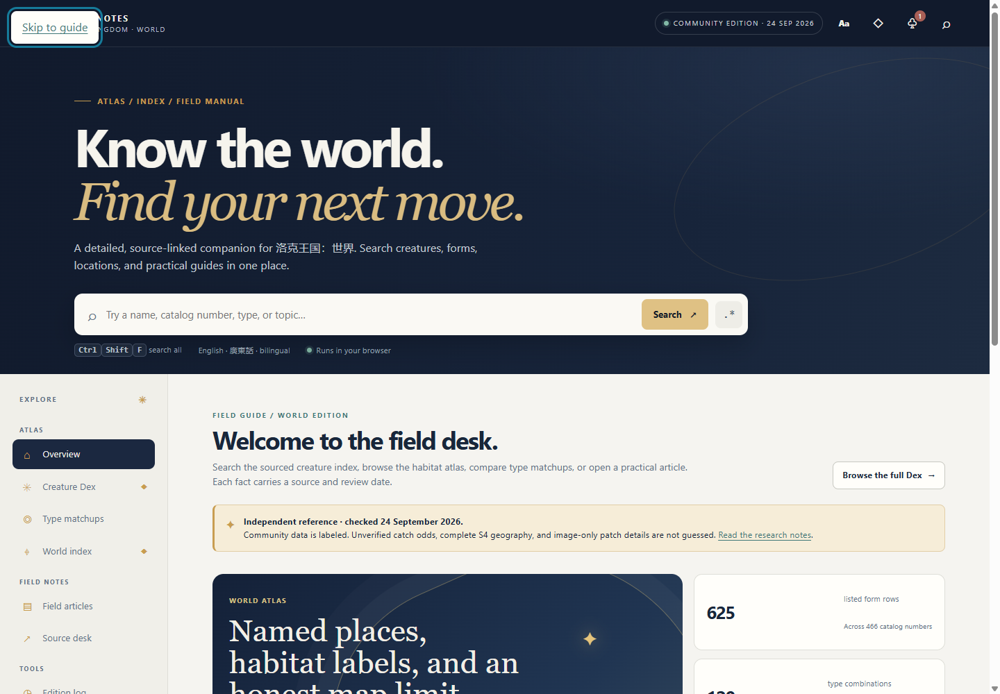
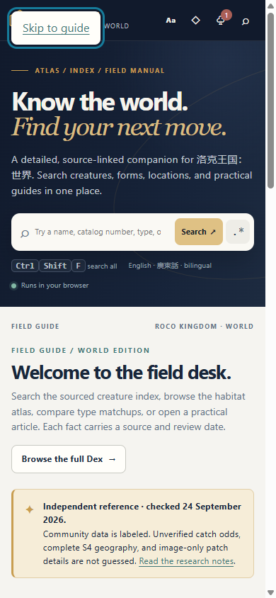
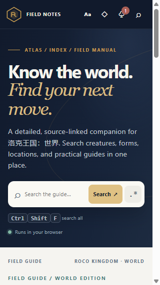
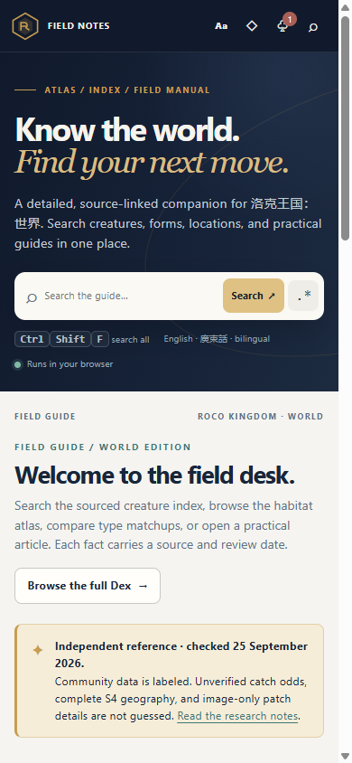

# Roco Kingdom Guide Capture Gallery

**Contents:** Four unchanged captures of the public [Roco Kingdom: World Atlas & Dex](https://roco-kingdom-world-field-atlas.dewlook123.chatgpt.site/) guide. The first pair shows production version 1; the second pair shows a local static build whose production status is not verified. Each image has a stated viewport and SHA-256 digest.

**Contents:** [Capture article](docs/captures/gallery.md) · [Design note](design/gallery-spec.md) · [License](LICENSE)

Production version 1 captures

### Desktop overview, 1440 × 1000

Image SHA-256: `eeac3abd2789431cc9953d4bc077355e73a45ced0a38f664ccd9c31ec00163ec`. Capture date and time are unavailable.

### Portrait mobile emulation, 390 × 844

Image SHA-256: `dcb588963b29538eb02133b12921ce8f107773a68895656708fd2bd7916e92d9`. This is not a physical-device capture. Capture date and time are unavailable.

Local static build captures, not verified as production

### Portrait narrow viewport, 320 × 568

Image SHA-256: `88311a662122c6abf1402b9523b0f382263d050018e7fdac91e5c5058ccee771`. Capture date: 2026-09-25 UTC. Capture time: unavailable.

### Portrait viewport, 390 × 844

Image SHA-256: `ee73bf0e3aa4a94d7402e5fdb99231bbf3fba5108cfa5e215b706a80455f7ef8`. Capture date and time: 2026-09-25 06:00:25.889 UTC.

The production pair is tied to source revision `ecfc27f8ca5182465df891a0f516278f9af9fb7f` and deployment `appgdep_6ab5de65b7d48191a9c98e2202637567`. The local-build pair is not linked to a public source revision or verified deployment. Their capture records say no personal data was visible; both are touch emulations, and their keyboard paths were not exercised. No image was retouched or reconstructed. The PNG files contain no text or EXIF metadata chunks.

The production audit found no console errors or exceptions, requests to other origins, failed resources, unnamed interactive controls, or horizontal page overflow at its two viewports. The local-build layout measurements found no horizontal page overflow, unnamed controls, console errors, exceptions, failed resources, or bad status responses. These focused checks are not a complete accessibility certification. See [the capture article](docs/captures/gallery.md).
